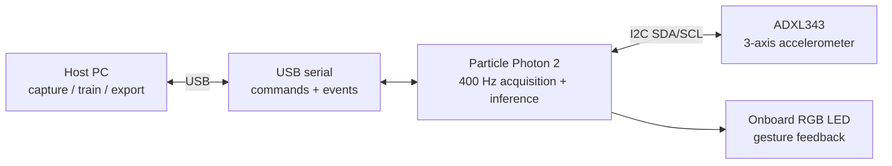

# System diagram

The final prototype uses the Photon 2 onboard RGB LED; it does not require four
external cue LEDs. Wiring details are in the
[hardware guide](wiring-and-bom.md), and runtime behavior is in the
[operating-mode guide](../architecture/operating-modes-and-verification.md).

